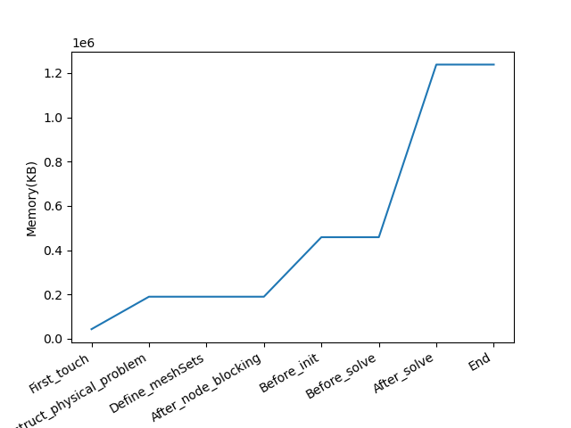

# MATools library

MATools is a library that offers various tools, including `MATimers` (timers in hierarchical form), `MATrace` (Trace generation for VITE), and `MAMemory` (memory footprint printing).

- Installation
- MATimer
- MATrace
- MAMemory
- Debugging tools

## Installation 

### MATools Environment requirements

Below is a list of the packages required, depending on the options used.

| Options         | Requirements |
|-----------------|--------------|
| Default         | X            |
| MATOOLS_TESTING | TCLAP        |
| MATOOLS_MPI     | MPI          |

Note that other options don't any extra pacckage.

### MATools installation with cmake

Command lines

```
cd MATools
mkdir build
cd $build
cmake -DMATOOLS_MPI=OFF -DCMAKE_INSTALL_PREFIX=../install ..
make install -j 8
export MATools_DIR=${BASE_PATH}/MATools/install/
export MATools_INCLUDE_DIR=${MATools_DIR}/include
export MATools_LIBRARY_DIR=${MATools_DIR}/lib
```

### MATools installation with spack

#### Add the MATools spack repository

```
spack add MATools/spack_repo
```

#### Installation without mpi

```
spack install matools 
```

#### Installation with mpi

```
spack install matools+mpi 
```

Do not forget to define `MATools_DIR`:

```
spack load matools
export MATools_DIR=$(spack find --loaded -p --format ":" matools | tr -d " :")
echo $MATools_DIR
```

### Add MATools in your project

You need to set the environment variable `MATools_DIR` to the install directory and add `find_package(MATools)` in your `CMakeLists.txt`.

## MATools

`MATools` is a HPC toolkit to profile MPI + X code.

### Minimal requirement in your code

Two minimal instructions are used to initiliaze all `MATools` tools : 

```
MATools::initialize(&argc,&argv)

... code ...

MATools::finalize();
```
## MATimers

MATimers are designed to track the execution time of a scope/routine whenever they are called. They are organized in a tree structure. Additionally, MATimers are compatible with MPI. They provide information such as the minimum time, average time, maximum time, percentage of execution time, and imbalance for each scope/routine.

### Minimal requirement 

Two instructions are required to use MATimers: 

```
MATools::MATimer::initialize(); // initialize(&argc,&argv) if mpi

... code ...

MATools::MATimer::finalize();
```
By using these functions, the root MATimerNode is created, allowing you to capture the runtime of your application.

### MATimers API

At the beginning of your function/routine, you can use one of the following instructions to capture a section:

```
START_TIMER("section_name");
```

or

```
Catch_Time_Section("section_name");
```

For nested sections, you can use the macro START_TIMER or Catch_Time_Section with:

```
Catch_Nested_Time_Section("nested_section_name");
```

Please note the following limitations: only one instruction is allowed per scope, and these timers are not thread-safe.

Another approach to capturing a section is by using the `chrono_section([&](args){...})` function, which returns the duration as a double. Additionally, you can add a chrono_section to the timers tree using the `add_capture_chrono_section("name", [&](args){...})` function.

### MATimers Output

There are two options for outputs, a file or in a unix shell. By default, the timers are sorted based on their times within a given MATimerNode level.

#### File option

The MATimers write file routine generates a file named MATimers.number_of_threads.perf or MATimers.number_of_MPI.perf, which contains the recorded timers.

#### Shell option

Example :

```
 |-- start timetable ---------------------------------------------------------------------|
 |    name                 |    number Of Calls |            max(s), |            part(%) |
 |----------------------------------------------------------------------------------------|
 | > root                  |                  1 |           0.000206 |         100.000000 |
 | |--> func5              |                  1 |           0.000160 |          77.587640 |
 |    |--> func4           |                  5 |           0.000153 |          74.576807 |
 |       |--> func3        |                 20 |           0.000139 |          67.707052 |
 |          |--> func2     |                 60 |           0.000100 |          48.768693 |
 |             |--> func1  |                120 |           0.000009 |           4.549541 |
 |-- end timetable -----------------------------------------------------------------------|
```
#### MATimers Verbosity

The verbosity levels are defined during compilation. Here are the different levels and their descriptions:


| Level       | Description      |
|-------------|------------------|
| level1                       | TThis level displays the timer name based on the current MATimerNode level when the start_timer or catch_time_section is called.      |

Example output with verbosity level = 1 (Note: Only the master rank displays this information with MPI).

```
MATimers_LOG: MATimers initialization 
Verbosity_message:-- > func3
Verbosity_message:---- > func2
Verbosity_message:------ > func1
MATimers_LOG: MATimers finalization
```
### MATimers Options

In order to modify the behavior of `MATimers`, you can utilize the following options:
Disable printing the timetable

#### Disable printing the timetable

To prevent the timetable from being printed, this routine should be called within the `MATools::Finalize()` routine.

```
MATools::MATimer::Optional::disable_print_timetable();
```

#### Disable writing the timetable file

To prevent the timetable from being written to a file, this routine should be called within the `MATools::Finalize()` routine.

```
MATools::MATimer::Optional::disable_write_file();
```

#### Enable the full tree mode

This option should be activated when all MPI processes do not build the same timers tree, such as in a master/slave scheme. This routine should be called within the `MATools::Finalize()` routine.

```
active_full_tree_mode();
```

#### Use HybridTimer instead of Catch_Nested_Time_Section

Since several `Catch_Time_Section` macros cannot be called in the same scope, a solution is to use the `Catch_Nested_Time_Section` macro. However, this macro can only be called once in a `Catch_Time_Section`. `MATimer` has been designed to be included in a set of short functions at the start of each one, however, in the case of long functions, you may wish to capture several sections of the same function. For this reason, the `HybridTimer` class has been developed. These use a start_time_section and end_time_section function instead of the constructor and destructor. They are also integrated into the timer tree.

Example (or see `test/est_hybrid_timer.cxx`):
```
HybridTimer first_timer("first_section"), second_timer("second_section");
first_timer.start_time_section();
first_section();
first_timer.end_time_section();
second_timer.start_time_section();
second_section();
second_timer.end_time_section();
```


However, it's important to note that `HybridTimers` will not modify the timer hierarchy, i.e. `HybridTimers` have no influence on the timer tree. The aim is to be able to intertwine timers. For example, this type of operation is allowed: A.start_time_section(), B.start_time_section(), A.end_time_section(), B.end_time_section().

Example (or see `test/est_hybrid_timer_short.cxx`): 
```
  HybridTimer first_timer("hybrid_timer");
  first_timer.start_time_section();
  {
    Catch_Nested_Time_Section("inside_hybrid_timer");
  }
  first_timer.end_time_section();
```
```
 |-- start timetable --------------------------------------------------------------------------------------------------------------------------------------|
 |    name                   |    number Of calls |            min (s) |           mean (s) |            max (s) |     time ratio (%) |            imb (%) |
 |---------------------------------------------------------------------------------------------------------------------------------------------------------|
 | > root                    |                  1 |           0.000141 |           0.000141 |           0.000141 |        100.000000% |          0.000000% |
 | |--> hybrid_timer         |                  1 |           0.000032 |           0.000032 |           0.000032 |         22.904766% |          0.000000% |
 | |--> inside_hybrid_timer  |                  1 |           0.000001 |           0.000001 |           0.000001 |          0.571250% |          0.000000% |
 |-- end timetable ----------------------------------------------------------------------------------------------------------------------------------------|
```

### Status of developments 

| MATimers feature                 | Status      |
|----------------------------------|-------------|
| Sequential                       | Done        |
| MPI                              | Done        |
| OpenMP                           | TODO        |
| MPI + OpenMP                     | not planned |
| Unbalanced timers trees with MPI | Done        |


## MAMemory

`MAMemory` offers a flexible approach to incorporate memory checkpoints in order to track memory usage at various points in the code. This tool utilizes `rusage` for memory-related measurements. `rusage` is a structure in programming that provides information about resource usage by a process or thread.

### Usage

Unlike other tools, `MAMemory` does not require an initialize or finalize routine. To obtain the memory usage at a specific point, you can utilize the `MATools::MAMemory::print_memory_footprint` function. This function creates a temporary memory checkpoint and displays the total memory usage size.

### API

`MAMemory` lets you add different points in your code to obtain the memory footprint during simulation. To do this, use the `Add_Mem_Point()` function or the `ADD_MEMORY_POINT()` macro to add point 1, then 2 and so on. You can also label these points with `Add_Mem_Point('my_point")`. To display this data, use the `TRACE_MEMORY_POINTS()` macro or the `print_checkpoints(MATools::MAMemory::get_MAFootprint())` function. To write the data, use the `WRITE_MEMORY_POINTS()` macro or the `write_memory_checkpoints(MATools::MAMemory::get_MAFootprint())` function. To simplify writing, you can also use `MAMemoryManager` such as (or see test/test_mamemory_api.cxx): 

```
using namespace MATools::MAMemory;
MAMemoryManager mem_manager;
for(int i = 0; i < 100 ; i++)
{
  std::vector<char> vec(10000*i);
  std::string name = "labed_" + std::to_string(i);
  Add_Mem_Point(name);
}
mem_manager.write_trace_memory_footprint();
mem_manager.print_trace_memory_footprint();
```

### Post-processing

#### With labels

```
python3 print_memory_footprint_with_labels.py MAMemoryFootprint.mem
```

Output example:  



### Status of developments 

| MAMemory feature                 | Status      |
|----------------------------------|-------------|
| Sequential                       | Done        |
| MPI                              | Done        |
| Collect checkpoints              | Done        |
| Add checkpoint names             | Done        |


## MATrace

MATools provides additional tools, including trace generation in the paje format, which can be read with VITE. This feature can be accessed using the namespace `MATools::MATrace`. VITE is a visualization tool commonly used for analyzing and visualizing traces and performance data generated by parallel and distributed applications. It provides a graphical interface that allows users to explore and understand the behavior of their applications by visualizing the execution flow, communication patterns, and performance metrics. 

### How to use it

The initialization and finalization routines for MATrace are hidden within the `MATools::initialize` and `MATools::finalize` functions, respectively. MATrace offers two routines, start and stop, to capture a task. The general approach for using MATrace is as follows:

```
MATools::MATrace::start()
do_something();
MATools::MATrace::stop("kernel_name");
```

The `finalize` routine is responsible for writing the MATrace files. In an MPI context, all the data is sent to the master process, which then writes the `MATrace.txt` text file.

### MATrace Options

#### Activate MATrace

By default, MATrace is disabled for both serial and MPI modes. To activate MATrace, you can use the following routine:

```
MATools::MATrace::Optional::active_MATrace_mode();
```
Please note that this routine should be called before the MATools::Finalize() routine.

#### Activate OpenMP mode

OpenMP mode is a special mode in MATrace where tasks are labeled by thread ID instead of MPI process ID. In this mode, a different approach is used to capture chrono sections. Here's an example:

```
#pragma omp parallel ...
{
 MATools::MATrace::omp_start()
 do_something();
 MATools::MATrace::omp_stop("kernel_name");
}
```
To activate the OpenMP mode, the MATrace mode must already be activated using the following routines:

```
MATools::MATrace::active_MATrace_mode();
MATools::MATrace::active_omp_mode();
```

These routines must be called before the first omp_start() routine.

WARNING: The OpenMP mode does not work correctly with MPI. If you are using MPI+OpenMP, the trace will be generated with all tasks and sent to the master node. However, tasks may overlap for the same thread ID since tasks are labeled with thread IDs in this mode.


Comment: The label can be calculated as follows: `MPI_ID * NB_THREADS + THREAD_ID`.

### Status of developments 

| MATrace feature  | Status      |
|------------------|-------------|
| Sequential       | Done        |
| MPI              | Done        |
| OpenMP           | Done        |
| Hybrid           | Not planned |
| Default color    | Done        |

## Debugging tools

For debugging purposes, you have the option to write the local timers tree for each MPI process. This can provide valuable information for identifying issues.

### write local timers tree for each MPI process

For more detailed information and examples, you can refer to the file test/test_mpi_debug_unbalanced_timers.cxx.

```
MATools::MAOutputManager::write_debug_file();
```

Advice: If you encounter a deadlock during the finalization function, you can disable printing and writing by using the following instructions:

```
MATools::MATimer::Optional::disable_print_timetable();
MATools::MATimer::Optional::disable_write_file();
```
These instructions will prevent the printing and writing of the timers' data, which can help in troubleshooting deadlock situations.
